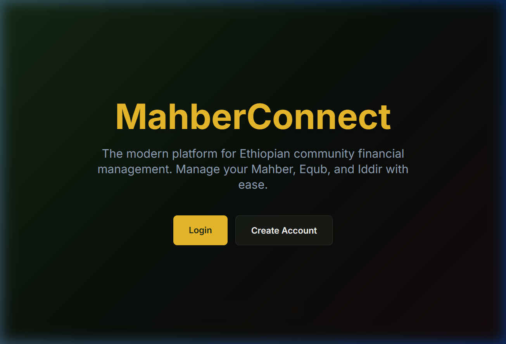
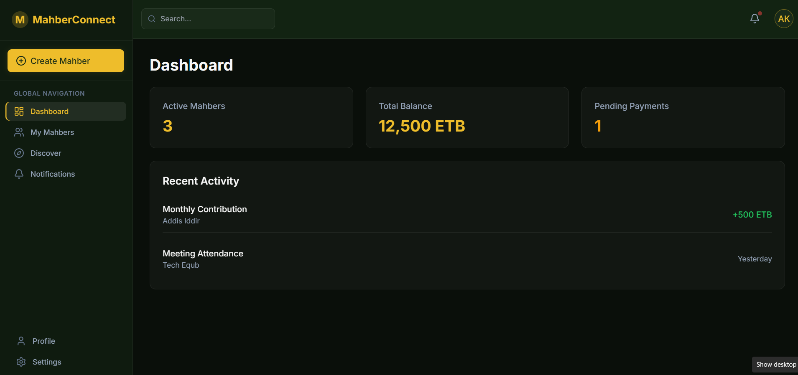
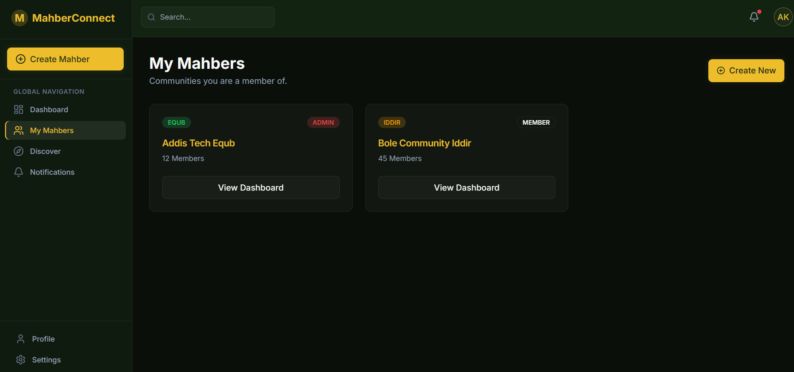

# MahberConnect 🚀

The modern platform for Ethiopian community financial management. Manage your **Mahber**, **Equub**, and **Iddir** with ease.

## 🌐 Live Demo
Check out the live application here: [https://mahberconnectfrontend.vercel.app/](https://mahberconnectfrontend.vercel.app/)

## 📸 Preview




## ✨ Features
- **Community Financial Management**: Streamline the management of traditional Ethiopian saving and insurance groups.
- **Modern Interface**: A sleek, responsive design built with Next.js and Tailwind CSS.
- **Secure & Reliable**: Built with security and community trust in mind.

---

## 🛠️ Getting Started

First, run the development server:

```bash
npm run dev
# or
yarn dev
# or
pnpm dev
# or
bun dev
```

Open [http://localhost:3000](http://localhost:3000) with your browser to see the result.

## 📂 Project Structure
- `src/`: Contains the source code of the application.
- `public/`: Static assets including the project screenshot.

## 🚀 Deployment
The easiest way to deploy your Next.js app is to use the [Vercel Platform](https://vercel.com/new).

Check out the [Next.js deployment documentation](https://nextjs.org/docs/app/building-your-application/deploying) for more details.
